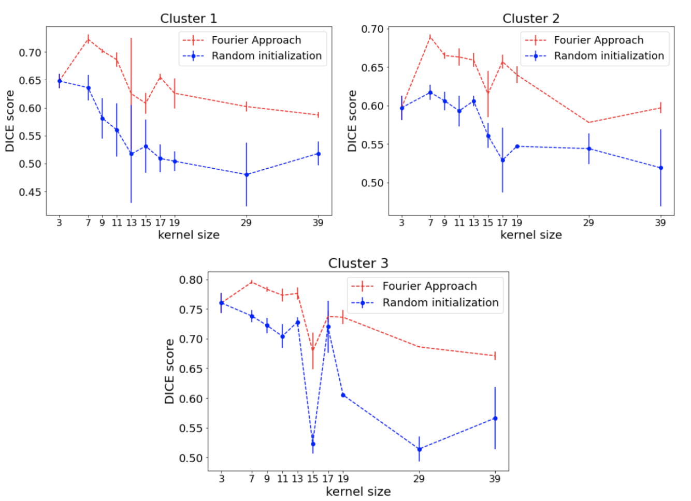

# Optimal Object-Resembling Convolutional Kernels for Image Segmentation

This repository contains train and inference code for the thesis project. 
We propose a new model, in which kernels of convolutional layers try to be similar to the object's shape. In this project, two approaches to the mentioned problem are considered. The first approach creates convolution kernels using Fourier decomposition coefficients, and the second one is based on Attention maps.


## Getting started
You can create and activate an anaconda environment:
```commandline
conda env create -f environment.yml
conda activate optimal_kernels
```

Train the model:
```python
python3 run.py --model hybrid --dataset_name birds --dataset_path path_to/Caltech-Birds
```

## Results
Results on the validation subset of **Caltech Birds** dataset for baselines and our the best methods:


And also for **ACDC** dataset:


### DICE vs kernel size dependence on Caltech Birds clusters:

